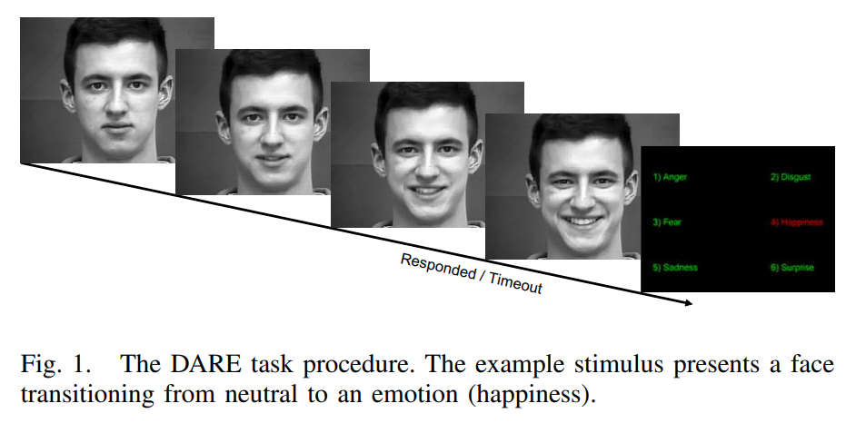

Run `active_experiment.py` to start the experiment.\
This task was tested both on Windows 10 and MacOS.

**Requierements:** \
`psychopy >= 2020.1.2`

# Eye Tracking test for the assessment of Autism Spectrum Disorder

The experimental task is an adapted version of the methodology described in [Jiang et al, 2019](https://ieeexplore.ieee.org/abstract/document/8857005).

In this experiment, twelve emotional stimuli corresponding to six basic emotions (i.e. anger, fear, disgust, joy, sadness, and surprise) are presented. After each presentation, participants are required to recognize the emotional expression.

The emotional stimuli are videos of actors whose facial expressions progressively change from a neutral emotional face to one of the six basic emotions (see Fig. 1). Jiang et al. (2019) used the Dynamic Affect Recognition Evaluation (DARE) set, however, it was not possible to obtain it.  Thus, for this experiment stimuli were taken from the Amsterdam Dynamic Facial Expression Set (ADFES; [van der Schalk et al., 2011](https://psycnet.apa.org/record/2011-18271-006)) which were also used in a passive eye-tracking and ASD task ([Vacas et al., 2021](https://journals.plos.org/plosone/article?id=10.1371/journal.pone.0252795)).Participants are asked to press the space bar as soon as they recognize the emotion depicted in the facial expression. Afterwards, particiapnts are asked to answer which emotion corresponds to the displayed one from the list of the six basic emotions. Both the response times (i.e., when the participant recognizes which affective state it is) and the response given by the participant (and whether the response is correct) are recorded.

This experiment was preceded by a two-trials practice block, to familiarize the participant with the task.

It is proposed to analyze eye-tracking data during the affective video presentation period. In this way it would be possible to implement ASD recognition algorithms during the facial emotion recognition task, considering that people with ASD would have different responses to other people's emotions (Jiang et al, 2019; [Pelphrey et al., 2002](https://link.springer.com/article/10.1023/A:1016374617369)). Jiang et al. (2019) used as features for their model the fixation location  (horizontal and vertical coordinates) indicating where the subject’s attention was focused and the fixation time, fixation frequency, fixation duration, and saccade amplitude that may demonstrate the altered oculomotor function in ASD.

## References
- Jiang, Ming, et al. "Classifying individuals with ASD through facial emotion recognition and eye-tracking." 2019 41st Annual International Conference of the IEEE Engineering in Medicine and Biology Society (EMBC). IEEE, 2019.
- Pelphrey, K. A., Sasson, N. J., Reznick, J. S., Paul, G., Goldman, B. D., & Piven, J. (2002). Visual scanning of faces in autism. Journal of autism and developmental disorders, 32(4), 249-261.
- Vacas, J., Antolí, A., Sánchez-Raya, A., Pérez-Dueñas, C., & Cuadrado, F. (2021). Visual preference for social vs. non-social images in young children with autism spectrum disorders. An eye tracking study. Plos one, 16(6), e0252795.
- Van Der Schalk, J., Hawk, S. T., Fischer, A. H., & Doosje, B. (2011). Moving faces, looking places: validation of the Amsterdam Dynamic Facial Expression Set (ADFES). Emotion, 11(4), 907.

