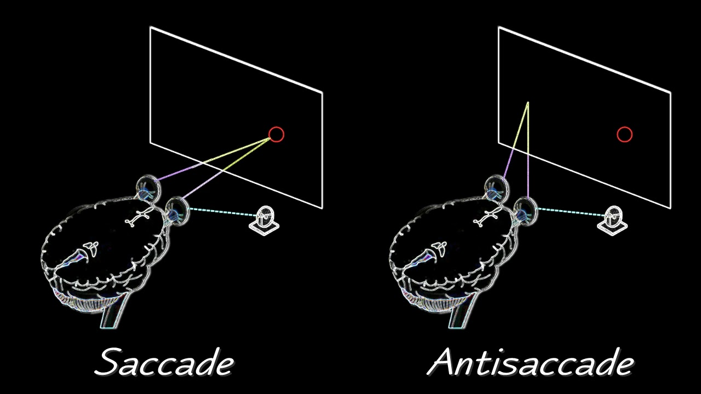

# Anti-Saccade Experiment

In the Anti-Saccade task, the participant begins each trial by looking at a fixation cross. Then, a stimulus appears on the side of the screen. When this happens, the participant must look to the other side of the screen, inhibiting the saccade reflex. Failures in such inhibition are related to neurological disorders at the level of the frontal cortex.

- Munoz, D. P., & Everling, S. (2004). Look away: the anti-saccade task and the voluntary control of eye movement. Nature Reviews Neuroscience, 5(3), 218-228.
