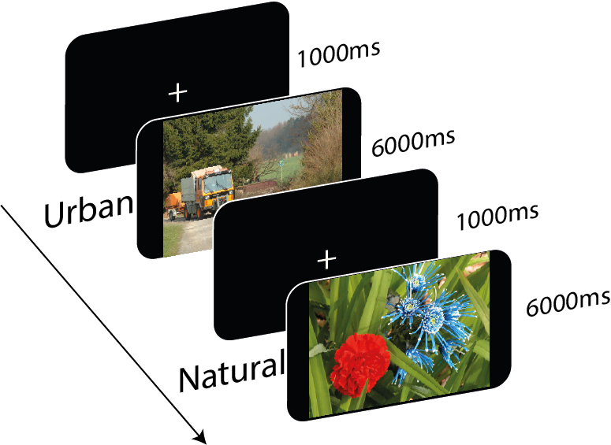

# Content Pictures Experiment

**Requierements:** \
`psychopy >= 2020.1.2`

The experiment here is an adapted and simplified version of the experiment [Onat et al., 2014](https://journals.plos.org/plosone/article?id=10.1371/journal.pone.0093254#s2). /This experiment dataset belongs to the "An extensive dataset of eye movements during viewing of complex images" [Wilming et al., 2017](https://www.nature.com/articles/sdata2016126#ref-CR23).

In this experiment only 2 of the 4 original categories of complex images are going to be displayed: natural and urban images. During this task subjects were instructed to passively study the images carefully during 6 seconds. Images were presented in a completely randomized order. 

 **Figure 1:** Figure of the task programmed here. This task is based on Onat et al (2014) experiment. In the figure it can be seen the times of each stimuli and example of each category of picture. The figure is original of this repository. 

In this abbreviated experiment only 10 figures are displayed (5 urban, 5 natural) from the approximately 150 of the original study. 

## References
- Onat, S., Açık, A., Schumann, F., & König, P. (2014). The contributions of image content and behavioral relevancy to overt attention. PloS One, 9(4), e93254.
- Wilming, N., Onat, S., Ossandón, J. P., Açık, A., Kietzmann, T. C., Kaspar, K., Gameiro, R. R., Vormberg, A., & König, P. (2017). An extensive dataset of eye movements during viewing of complex images. Scientific Data, 4, 160126.