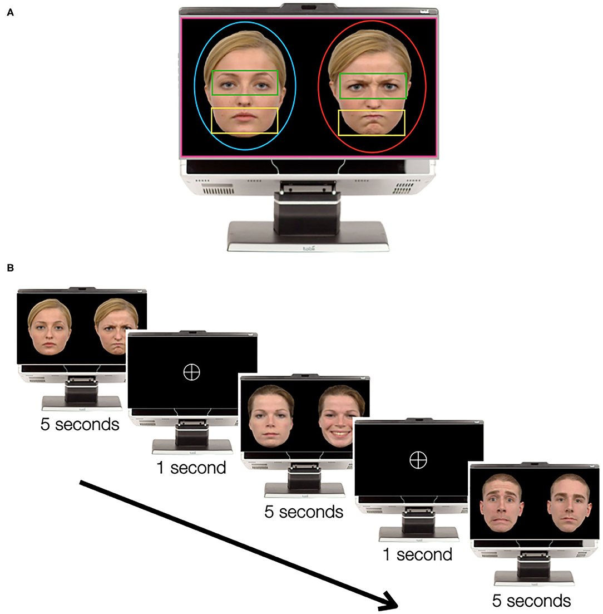

# Passive emotion recognition experiment 

Run `passive_experiment.py` to start the experiment.\
This task was tested both on Windows 10 and MacOS.

**Requierements:** \
`psychopy >= 2020.1.2`

The experimental task is an adapted version of the methodology described in [Bochet et al, 2021](https://www.frontiersin.org/articles/10.3389/fpsyt.2020.568997/full).

This eye-tracking paradigm is known as the "emotional face task". It simply consists of the simultaneous presentation of two faces to the participants, on the left and the right side of the screen. One of these faces has emotional content, while the other is a neutral facial expression (see Figure 1).

 **Figure 1:** Figure of the task programmed here. This task is based on Bochet et al (2021) experiment. In the figure it can be seen the times of each stimuli and example of each category of picture. The figure has be obtained from the original experiment paper. 

This task has been explored to compare Autism Spectrum Disorder (ASD) and neurotypical subjects' emotional and social processing. Considering that the former have a diminished orientation to social stimuli, it is expected that they will explore emotional faces differently. This exploration can be reflected in, for example, fewer fixations to emotional faces, among other eye-tracking measures that could be indicative of impaired face processing.

We were not able to obtain the same stimuli that were used in the original experime (Bochet et al., 2021). For this experiment stimuli were taken from the Amsterdam Dynamic Facial Expression Set (ADFES; [van der Schalk et al., 2011](https://psycnet.apa.org/record/2011-18271-006)) which were also used in a similar passive eye-tracking and ASD task ([Vacas et al., 2021](https://journals.plos.org/plosone/article?id=10.1371/journal.pone.0252795)).

## References
- Bochet, A., Franchini, M., Kojovic, N., Glaser, B., & Schaer, M. (2021). Emotional vs. Neutral Face Exploration and Habituation: An Eye-Tracking Study of Preschoolers With Autism Spectrum Disorders. Frontiers in Psychiatry, 1491.
- Vacas, J., Antolí, A., Sánchez-Raya, A., Pérez-Dueñas, C., & Cuadrado, F. (2021). Visual preference for social vs. non-social images in young children with autism spectrum disorders. An eye tracking study. Plos one, 16(6), e0252795.
- Van Der Schalk, J., Hawk, S. T., Fischer, A. H., & Doosje, B. (2011). Moving faces, looking places: validation of the Amsterdam Dynamic Facial Expression Set (ADFES). Emotion, 11(4), 907.