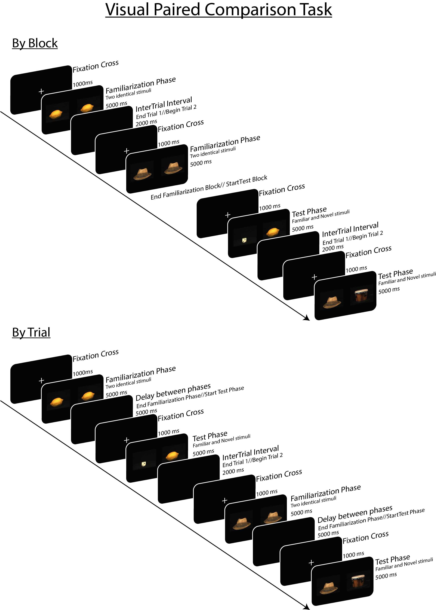

# Visual Paired Comparison Task

To Run By Blocks version:
 - Run `vpc_by_blocks.py` to start the experiment.

To Run By Trials version:
 - Run `vpc_by_trials.py` to start the experiment.

This task was tested both on Windows 10 and MacOS.

**Requierements:** \
`psychopy >= 2020.1.2`

The experimental task is an adapted version of the Visual Paired Comparison methodology described in different articles trying to automatically asses dementia such as [Bott et al, 2017](https://www.frontiersin.org/articles/10.3389/fnins.2017.00370/full) and [Crutcher et al, 2009](https://journals.sagepub.com/doi/10.1177/1533317509332093).

This eye-tracking paradigm is known as the "Visual Paired Comparisonk" or VPC. In this task participants are shown first two identical stimuli, this phase is called `Familiarization`. Afterwards, in a second phase called `Test` participants are shown at the same time one of the previously seen 'familiar' stimulus and one unseen stimulus, the 'novel' one.

In the literature this task can be find in two different formats separating the familiarization and test phases: `By Blocks` ([Bott et al, 2017](https://www.frontiersin.org/articles/10.3389/fnins.2017.00370/full)) and `By Trials` ([Crutcher et al, 2009](https://journals.sagepub.com/doi/10.1177/1533317509332093)). The `By Blocks` option separates the familiarization and test phases into two separate blocks, having then one (or more) block for familiarization and one block for the test phase (see Figure 1). On the other hand, the `By Trials` methodology consist on showing consecutively the two phases inside the same trial. In this case, at the beginning of the trial the familiarization phase occurs and after a variable delay (in the literature this delay could take up to 2 minutes, it was reduced here for practicality purposes) the test phase of the same familiar stimulus occurs, and afterwards a new trial begins for a new stimuli again composed by familiarization and test (see Figure 1). 

 **Figure 1:** Figure of the Visual Paired Comparison Task. Here we show the two versions of the task: "by blocks" and "by trials". By blocks the familiarization and test phases are differentiated into two different blocks. On the other hand, by trial task the familiarization and test phase occur in the same trial separated by a delay. 

This task has been found to be useful in predicting dementia (e.g. Alzheimer's disease). It has been observed that participants with even mild cogntive impairment spend less time looking at the novel stimulus in the test phase than control participants.

We were not able to obtain the same stimuli that were used in the original set of experiments. For this experiment purpose, the stimuli were taken from the Amsterdam Library of Object Images (ALOI; [Geusebroek et al., 2005](https://link.springer.com/article/10.1023/B:VISI.0000042993.50813.60)) open [dataset](https://aloi.science.uva.nl/).

## References
- Bott, N. T., Lange, A., Rentz, D., Buffalo, E., Clopton, P., & Zola, S. (2017). Web Camera Based Eye Tracking to Assess Visual Memory on a Visual Paired Comparison Task. Frontiers in Neuroscience, 11, 370.

- Crutcher, M. D., Calhoun-Haney, R., Manzanares, C. M., Lah, J. J., Levey, A. I., & Zola, S. M. (2009). Eye tracking during a visual paired comparison task as a predictor of early dementia. American Journal of Alzheimer’s Disease and Other Dementias, 24(3), 258–266.

- Geusebroek, J.-M., Burghouts, G. J., & Smeulders, A. W. M. (2005). The Amsterdam Library of Object Images. International Journal of Computer Vision, 61(1), 103–112.

- Gills, J. L., Glenn, J. M., Madero, E. N., Bott, N. T., & Gray, M. (2019). Validation of a digitally delivered visual paired comparison task: reliability and convergent validity with established cognitive tests. GeroScience, 41(4), 441–454.

- Richmond, J., Sowerby, P., Colombo, M., & Hayne, H. (2004). The effect of familiarization time, retention interval, and context change on adults’ performance in the visual paired-comparison task. Developmental Psychobiology, 44(2), 146–155.
